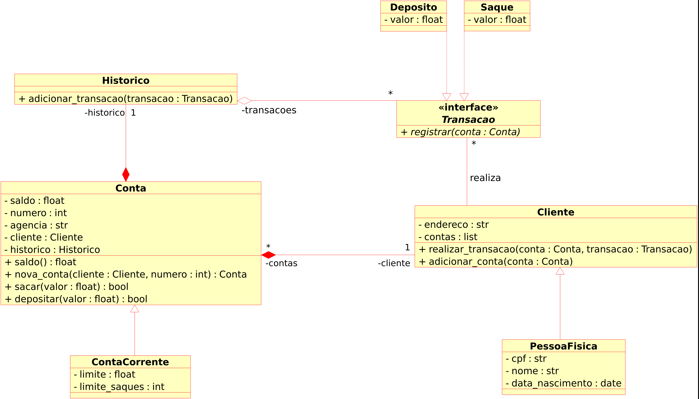

# Desafio: Modelando Sistema Bancário em POO com Python
## Objetivo
Modelar um sistema bancário com linguagem Python usando o paradigma de orientação a objeto
## Modelo de classes
O código segue o seguinte modelo de classes UML:

